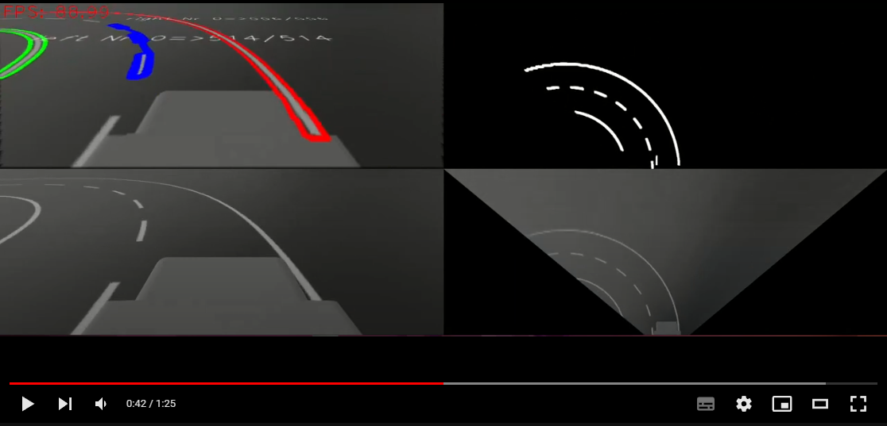

# Lane Detection

## Lane Detection Demo

Click [here](https://www.youtube.com/watch?v=NhFA8oFuCJg) to see a demo.
In this video, you can see the results of our lane detection algorithm in action. The video showcases how the filter and transforming change the input of the subscriber.

1. **Top Left:** The original image with highlighted lane detection.
   - Left lanes are marked in green.
   - The middle lane is marked in blue.
   - Right lanes are marked in red.

2. **Bottom Left:** The original image obtained from our subscriber.

3. **Bottom Right:** The image after transformation through the Eagle View, providing a top-down perspective.

4. **Top Right:** The Eagle View image after color filtering and additional processing, as described in previous chapters.

## Setup and Warinings

### Package.xml
The package.xml contains basic information about the ROS2 package, which is broken down as follows:
- xml version: contains the version of the xml format used.
- xml-model: the link given here refers to corresponding ros2 specifications on how package.xml files should be designed. The schema type is a general xml schema type
- format: This indicates which ros2 package format was used for the creation. Normally format 3 is used.
- Name: Name of the ros2 package.
- Version: Here you can change the version number depending on the changes, should a package be updated. 
- description: Can be used to specify a basic abstraction of the package's function.
- maintainer: The guy who takes care of maintenance of the package.
- License: We use Apache-2.0 to ensure free use of the package.
- Dependencies:
    - generate_parameter_library: This library allows us to include declarative parameters, and also ensures the connection to ros2 with the help of codegen. This is not a standard ros2 package, and must therefore be installed later.
'''
sudo apt install ros-humble-generate-parameter-library-py
'''
    - cv2: Is included here to make image processing as simple as possible. Has a good interface for ros2
    - math: Is included to ensure complex calculations in eagle view.
    - tf2_ros: enables the integration of different transformation data. Used here to determine the z coordinate of the camera.
    - rclpy: Basic ros2 python library, without which a ros2 node cannot be built or started in python.
    - lanelet_msgs: Message type, which transmits a header and two point lists.
    - numpy: This is useful for fast and complex calculations in Python.
    - argparse: Parser for command line options. is used for debugging.
    - sensor_msgs: This is used to integrate the image and cameraInfo messages.
    - geometry_msgs: Used for the inclusion of Point Messages, which transmits Lanelet_msgs Point Lists.
    - cv_bridge: Used for multiple image to cv2 conversions.
    - sys: We address very systemic processes, which means we have to get information directly from the system.
    - abc: Allows us to use abstract classes and methods. Used in region_of_interests_classes.py and region_of_interests.py to implement abstract methods.

#### buildtype
determines under which conditions the build tool builds the package. Here, ament_python was chosen to build a python package.

### setup.py
Used in python packages to define the execution points of the nodes and to create specific modules. Used here to create a module using the parameter file to bind it properly. The generate_parameter_py dependency is also included here.

### config
This is where the files with the parameters for the individual nodes are normally stored. In this case, it contains the params.yaml, which contains the execution parameters. You can take a look at it. Each individual parameter of the file has its own description.

### lane_detection
This is the folder in which the executables are stored. Contains a subfolder image_processing, in which all self-created libraries are stored.

### image_lanelet.py
In terms of the idea, the image_lanelet node takes an already adjusted image, which then has to be adjusted so that The lines of the lane are recognised and 2 point lists are created from these lines for the middle and right lane respectively, which are then output using a lanelet_msg. the lanelet_msg contains a header with metadata of the data processing

# Lane Detection Project Documentation

> ⚠️ **Disclaimer**: This chapter and documentation were primarily authored by the document's creator and later refined with the assistance of ChatGPT for grammar and spelling checks. Additionally, some content was translated from German to English to ensure comprehensibility. Additionaly ChatGPT helped to create a markdown code for spezific request like text highlighting etc. 

## Subscribers

In our lane detection project, we employ subscribers to receive and process data from various sources within the ROS (Robot Operating System) environment.

### Camera Information Subscription

- **Topic:** `/citicar/camera/camera_info`
- **Message Type:** `CameraInfo`
- **Callback Function:** `self.callback_camera_info`
- **Queue Size:** Configurable (`queue_size_subscribe` parameter)

This subscription retrieves essential camera calibration data necessary for eagle view transformations and accurate lane detection.

### Lane Data Subscription

- **Message Type:** Configurable based on project requirements
- **Topic:** Customizable via the `topic_subscribe` parameter
- **Callback Function:** `self.callback_get_lane`
- **Queue Size:** Adjustable (`queue_size_subscribe` parameter)

This subscription receives lane data messages, enabling real-time lane analysis and visualization.

## Publishers

In our lane detection project, publishers play a crucial role in disseminating lane information and data.

### Published Lane Data

Our lane detection project publishes lane information using a structured approach:

#### Header Information

(`std_msgs/Header`): Contains message details like timestamps and frame IDs.

#### Lane Representations

(`LineString`): Describes lanes as sequences of points.

#### Location Data

(`geometry_msgs/Point[]`): Defines lane geometry with `geometry_msgs/Point` elements.

##### Dynamic Lane Handling

Our system dynamically determines the number of lanes and generates separate lane messages for each detected lane. This approach offers flexibility and adaptability for different road scenarios.

## Chapter Preparation

In this section, we'll outline the structure and content of the chapters in this documentation.

### Chapter 1: Eagle View and Transformation

The `EagleView` class is central to our lane detection project, enabling image transformation and undistortion.

#### Class Overview

The `EagleView` class transforms images into a top-down view, removes distortion, and computes a transformation matrix (`H`).

Takes values for cropping limits, point of view, and cutting.

#### Transformation Matrix (Homography)

This computes the homography matrix `H` based on specified points and image height, length.

#### Undistortion

`undistort_image(image)` removes lens distortion using camera intrinsic and distortion parameters.

#### Image Transformation

- `transform_image(raw_image)`: Applies perspective transformation to create the eagle view.
- `reverse_transform_image(transformed_image)`: Reverses the eagle view transformation.

### Chapter 2: Region of Interest (ROI) Configuration

In our lane detection project, we use ROIs to create black masks, effectively hiding specific image regions like the car and the sky. These masks exclude unwanted elements from the image, enhancing lane detection accuracy.

#### Combining ROIs

The `Roi_Handler` class allows us to configure multiple ROIs, each represented by `SkyRoi` or `CarHoodRoi` instances. These ROIs are designed to create black masks over specific areas, effectively hiding them from further processing.

#### Image Filtering

By applying these black masks to the image using bitwise operations, such as AND, we effectively hide regions that are not of interest. This results in an image that retains only the relevant areas for lane detection.

### Chapter 3: Sky and Car Hood Region Masks

Two key ROIs, `SkyRoi` and `CarHoodRoi`, play a crucial role in our lane detection process:

#### SkyRoi

The `SkyRoi` creates a black mask over the sky region in the image, effectively hiding it from further analysis. This ensures that lane detection focuses solely on the road, excluding irrelevant sky portions.

#### CarHoodRoi

The `CarHoodRoi` masks specific areas, such as the car's hood, to create a black mask that hides these regions from lane detection. This is particularly useful when the presence of the car could interfere with lane analysis.

These ROIs improve adaptability to different road scenarios by excluding unwanted image regions, enhancing lane detection precision.

### Chapter 4: Color and Kernel Filtering 

Color filtering plays a significant role in identifying lane markings and relevant features on the road. 

#### Color Range Definition

Before applying color filtering, we define specific color ranges that represent the characteristics of lane markings and road features. Each color range is defined by its lower and upper HSV (Hue, Saturation, Value) values. These color ranges serve as the criteria for identifying relevant colors in the image.

#### Color Filtering Process

The `Color_Filter_Handler` class processes the input image to filter out colors within the defined ranges. The process involves the following steps:

1. Conversion to HSV: The input BGR image is converted to the HSV color space, which is more suitable for color-based filtering.

2. Color Range Comparison: For each defined color range, the class compares the HSV values of each pixel in the image. If a pixel's HSV values fall within any of the specified color ranges, it is included in the filtered mask.

3. Binary Mask Creation: The result is a binary mask where the pixels representing the detected colors are set to white (255), while others remain black (0).

#### Morphological Operations

To further refine the binary mask and prepare it for lane detection, morphological operations are applied. These operations include erosion and dilation:

- Erosion: This operation helps reduce noise and small isolated regions in the mask by eroding away the pixel boundaries of objects.

- Dilation: Dilation expands the white regions in the binary mask, effectively filling gaps and enhancing the continuity of lane markings.

#### Adaptive Thresholding Segmentation

The `adaptive_thresholding_segmentation` function applies adaptive thresholding-based segmentation to detect lane lines in a binary image. It employs a dynamic region of interest (ROI) and adaptive thresholding to identify lane regions accurately.

**Key Steps:**
- Calculate vertical distance and width thresholds.
- Identify connected components in the binary image.
- Filter connected components based on vertical distance and width criteria.
- Generate a filtered image with detected lane regions.

This technique enhances lane detection accuracy by isolating lane lines effectively.

**Source**: [Read the Paper](https://dl.acm.org/doi/pdf/10.1145/3573428.3573524)

## Contour Charactersation: Preperation for the Algorithm

## `LaneCountour` Class 

The `LaneCountour` class represents individual lane contours detected in images and encompasses various attributes to comprehensively characterize these contours.

### Contour Characteristics
- `contour_length`: Size of the contour.
- `contour_area`: Area enclosed by the contour.
- `center`, `cx`, `cy`: Coordinates for positioning.
- `angle`: Contour's orientation angle.

### Aspect Ratios and Shape
- `b_box_aspect_ratio`, `b_box_aspect_ratio_2`: Aspect ratios based on bounding box dimensions.
- `area_aspect_ratio`: Relates contour length to area.

### Statistical Measures
- `x_std`, `y_std`: Standard deviations of contour points.
- `deviation_angle`: Angle of deviation within the contour.

### Extreme Values
- `x_value_highest_row`, `x_value_lowest_row`: Extreme x-values among contour rows.

### Fitting Error
- `line_fit_error`: Error in linear fitting for the contour.

These attributes collectively provide a comprehensive characterization of detected lane contours, facilitating effective analysis and lane detection processes.

## `FilterMiddleLines` Class

In our lane detection system, the identification of the middle lane is a critical step. The `FilterMiddleLines` and `LaneContourHandler` classes play a pivotal role in this process.

### Filtering Middle Lane Lines

The `FilterMiddleLines` class is responsible for filtering potential lane contours to identify the middle lane. It applies various criteria to determine if a detected lane contour is a candidate for the middle lane. These criteria include:

- Contour length within specified bounds.
- Angle of deviation within an acceptable range.
- Aspect ratio of bounding boxes.
- Line fit error.
- Standard deviation of angles.

This multi-faceted filtering ensures that only valid middle lane candidates are considered for further processing.

## LaneContourHandler Class - Main Algorithm

In our lane detection system, the `LaneContourHandler` class is the core component responsible for processing and analyzing detected lane contours. It serves as the main algorithm that identifies and categorizes lane contours into left, right, and middle lanes.

### Initialization

The `LaneContourHandler` class includes a set of attributes that control and configure various aspects of the lane contour detection and processing. These attributes collectively influence the behavior and criteria used for processing detected lane contours.

### Contour Processing

The core functionality of the `LaneContourHandler` class involves processing detected contours. It filters potential lane contours based on length, angle, width, and other criteria. It also separates contours into left and right lanes and performs polynomial regression to create curves representing these lanes.

### Creating Lane Curves

The `create_the_lanes` method processes middle lane contours and creates a middle curve. It sorts contours by distance from a player point, applies filtering criteria, and separates them into left and right lines. Polynomial regression is then applied to these contours to create curves for the lanes.

### Filtering Middle Lane Contours

The `filter_through_middle_lines` method filters middle lane contours based on their deviation angle, distance from each other, and angle difference. It follows these steps:

1. Filters the first contour based on angle and distance criteria.
2. Initializes a list to store filtered contours.
3. Iterates through remaining contours:
   - Calculates the angle between previous and current contour.
   - Calculates the distance between previous and current contour.
   - Calculates the angle difference between current and previous contour.
   - Checks if the angle difference exceeds the maximum allowed.
   - Checks if distance and angle meet the criteria.
4. Updates the list of middle lane contours with the filtered result.

This process ensures that only valid middle lane contours are retained based on their distance and angle characteristics.

### Determining if a Line is Left or Right

The `is_Left` method checks whether a given point is positioned to the left of a curve defined by x and y values. It follows these criteria:

1. Checks if the point's x-coordinate is outside the defined range or close to the boundaries. If so, it assigns the point to the "left" or "right" side accordingly.
2. Determines if the maximum y-coordinate point is outside the defined range and assigns it to the appropriate side.
3. Computes an "erg" value based on contour centroids and checks if it indicates a left or right direction.
4. Optionally, applies a tangent angle filter based on the curvature and tangent angles to determine the point's position.
5. Alternatively, checks if the point's x-coordinate is below the average x-coordinate of the middle line.
6. For the "filter_bottom_value" case, identifies the bottom point's x-coordinate and compares it to the average x-coordinate of the middle line.
7. In cases where no other criteria apply, it compares the average x-coordinate of the contour to the point's x-coordinate to make a determination.

This method provides a robust way to classify points as being on the left or right side of the lane based on a combination of criteria.

### Determining if a Line is Left or Right

The `is_Left` method checks whether a given point is positioned to the left of a curve defined by x and y values. It follows these criteria:

1. Checks if the point's x-coordinate is outside the defined range or close to the boundaries. If so, it assigns the point to the "left" or "right" side accordingly.
2. Determines if the maximum y-coordinate point is outside the defined range and assigns it to the appropriate side.
3. Computes an "erg" value based on contour centroids and checks if it indicates a left or right direction.
4. Optionally, applies a tangent angle filter based on the curvature and tangent angles to determine the point's position.
5. Alternatively, checks if the point's x-coordinate is below the average x-coordinate of the middle line.
6. For the "filter_bottom_value" case, identifies the bottom point's x-coordinate and compares it to the average x-coordinate of the middle line.
7. In cases where no other criteria apply, it compares the average x-coordinate of the contour to the point's x-coordinate to make a determination.

This method provides a robust way to classify points as being on the left or right side of the lane based on a combination of criteria.

### Important Helper Functions

In addition to the main algorithms and classes, several helper functions contribute to the lane detection process. These functions serve specific purposes and aid in various stages of the lane detection pipeline. Here's a brief overview of some key helper functions:

### Creating Left and Right Lanes
- `create_left`: Sorts and processes detected left lane contours to identify lane points.
- `create_right`: Sorts and processes detected right lane contours to identify lane points.

### Contour Approximation
- `approximate_contours_to_line`: Approximates contours to create lines for further analysis.
- `approx_curve`: Approximates a set of contours to create a curve.

### Polynomial Regression
- `perform_polynomial_regression`: Performs polynomial regression on a set of points to create a fitted curve.

